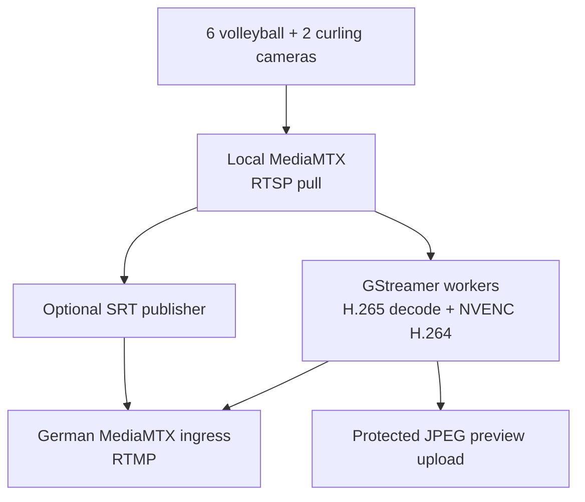

# Arena76 Local Media Node

Локальный медиашлюз Arena76 принимает восемь камер по RTSP внутри LAN,
перекодирует H.265 в H.264 аппаратным NVENC, формирует JPEG-превью и
отправляет потоки на удалённый узел `arena-rtmp-node`.

Репозиторий создан из проверенной конфигурации действующего сервера
`arena76-local`. Первая версия намеренно сохраняет работающие медиапайплайны;
она не устанавливается на production автоматически.

## Поток данных



## Production baseline

| Component | Current role |
|---|---|
| MediaMTX 1.20.1 | Pulls eight private camera RTSP sources |
| GStreamer 1.28.2 | Builds RTMP/SRT pipelines and JPEG previews |
| RTX 3060 Ti | H.265 hardware decode and H.264 NVENC encode |
| `arena-volleyball@1..6` | Six active volleyball publishers |
| `arena-curling@1..2` | Two active curling publishers |
| `arena-srt@7`, `arena-srt@9` | Optional, currently disabled |
| `arena-mediamtx-direct-route` | Routes remote media traffic outside the user VPN |

The video profile used by the active camera workers is H.264 High, CBR
6 Mbit/s, GOP 60, NVENC preset `p4`, without audio transcoding.

## Repository layout

- `workers/` — current Python/GStreamer camera and SRT workers;
- `scripts/` — validation, compatibility launchers and route helper;
- `systemd/` — packaged service definitions;
- `mediamtx/` — secret-free MediaMTX example;
- `config/` — schemas only, never live values;
- `legacy/` — disabled historical camera launchers retained for reference;
- `tests/` — repository, configuration and policy tests;
- `docs/` — architecture, deployment, operations and security.

## Safety boundary

The repository never contains camera URLs, camera passwords, destination RTMP
URLs, SRT credentials, preview tokens or the actual direct-route address.
Production values remain in protected files below `/etc/arena76`,
`/etc/arena-srt` and `/etc/mediamtx`.

## Validation

```bash
./scripts/validate.sh
```

The validator is read-only. See [deployment](docs/DEPLOYMENT.md),
[operations](docs/OPERATIONS.md), [security](docs/SECURITY.md) and the
[architecture](docs/ARCHITECTURE.md). The audited differences between the
running host and this candidate are recorded in the
[production baseline](docs/PRODUCTION_BASELINE.md).

When GStreamer is installed, validation also requires all runtime and NVIDIA
elements used by the workers. On a source-only workstation that check is
reported as skipped; syntax, policy and repository tests still run.
